# tasty-tales
# Tasty Tales

A full-stack recipe sharing web application built with Django. Users can register, share their own recipes, and review other people's creations with a 1–5 star rating system. The project was developed as the Individual Capstone Project for the AI Augmented Full-Stack Bootcamp.

**Live site:** [https://tasty-tales-01-5fd3b9eee72d.herokuapp.com/](https://tasty-tales-01-5fd3b9eee72d.herokuapp.com/)

**Repository:** [https://github.com/YOUR-USERNAME/tasty-tales](https://github.com/Ahmedaklak/tasty-tales)

**Project board:** (https://github.com/users/Ahmedaklak/projects/7)

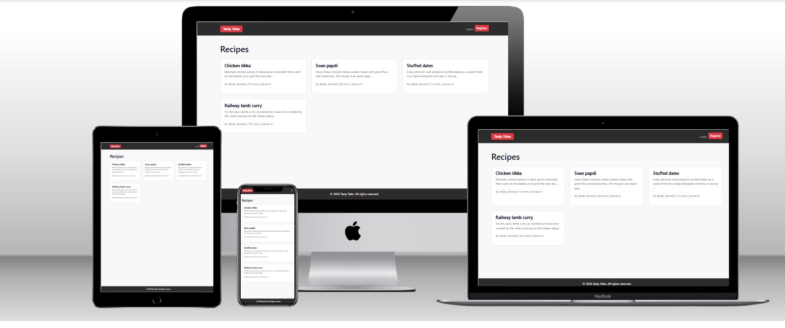

---

## Table of Contents

- [User Experience (UX)](#user-experience-ux)
  - [Project Goals](#project-goals)
  - [User Stories](#user-stories)
  - [Agile Methodology](#agile-methodology)
  - [Wireframes](#wireframes)
  - [Entity Relationship Diagram](#entity-relationship-diagram)
  - [Design Choices](#design-choices)
- [Features](#features)
  - [Existing Features](#existing-features)
  - [Future Features](#future-features)
- [Technologies Used](#technologies-used)
- [Database Design](#database-design)
- [Testing](#testing)
  - [Automated Testing](#automated-testing)
  - [Manual Testing](#manual-testing)
  - [Validator Testing](#validator-testing)
  - [Browser Compatibility](#browser-compatibility)
  - [Responsiveness Testing](#responsiveness-testing)
  - [Bugs](#bugs)
- [Deployment](#deployment)
  - [Heroku Deployment](#heroku-deployment)
  - [Security](#security)
  - [Forking the Repository](#forking-the-repository)
  - [Cloning the Repository](#cloning-the-repository)
- [Credits](#credits)
- [AI Tools](#ai-tools)

---

## User Experience (UX)

### Project Goals

The goal of Tasty Tales is to provide a community platform where home cooks can share, discover, and review recipes. The application solves a common problem: most recipe sites are cluttered with ads and don't let users contribute. Tasty Tales is a clean, user-driven recipe hub where anyone can register, post their recipes, and leave honest reviews for others.

The target audience is home cooks of all skill levels who want a simple, no-nonsense platform to store and share recipes.

### User Stories

User stories were created in GitHub Issues using a custom user story template and tracked on a GitHub Projects kanban board. Each story was linked to project goals and moved through To Do, In Progress, and Done columns during development.


| ID | User Story | MoSCoW |
|----|-----------|--------|
| 1 | As a visitor, I can view a list of published recipes so that I can browse what's available. | Must Have |
| 2 | As a visitor, I can click on a recipe to view its full details so that I can follow the cooking instructions. | Must Have |
| 3 | As a visitor, I can register for an account so that I can create and share my own recipes. | Must Have |
| 4 | As a registered user, I can log in and out so that I can access my account securely. | Must Have |
| 5 | As a logged-in user, I can create a new recipe so that I can share it with the community. | Must Have |
| 6 | As a recipe author, I can edit my own recipe so that I can correct mistakes or update the content. | Must Have |
| 7 | As a recipe author, I can delete my own recipe so that I can remove content I no longer want to share. | Must Have |
| 8 | As a logged-in user, I can leave a star rating and review on a recipe so that I can share my opinion. | Should Have |
| 9 | As a review author, I can delete my own review so that I can remove feedback I no longer stand by. | Should Have |
| 10 | As a user, I can see success/error messages after performing actions so that I know the action was completed. | Must Have |
| 11 | As a visitor, I can see paginated recipe listings so that the page loads quickly and is easy to browse. | Should Have |
| 12 | As a user, I can see the login state reflected in the navbar so that I know whether I'm logged in. | Must Have |

### Agile Methodology

The project was managed using Agile methodology through GitHub Projects. A kanban board with To Do, In Progress, and Done columns was used to track progress throughout development. User stories were created using a custom issue template stored in `.github/ISSUE_TEMPLATE/user-story-template.md`, with each story including acceptance criteria that mapped directly to project features.

MoSCoW prioritisation was applied to all user stories to ensure the most critical features (account registration, recipe CRUD, authentication) were delivered first. "Should Have" features like reviews and pagination were implemented once the core functionality was stable.

The  is publicly visible on the GitHub repository under the Projects tab.

### Wireframes

Low-fidelity wireframes were created for all pages before development began. These guided the layout decisions and were referenced throughout the build process to ensure the final implementation matched the planned design.

#### Home Page (Logged Out)
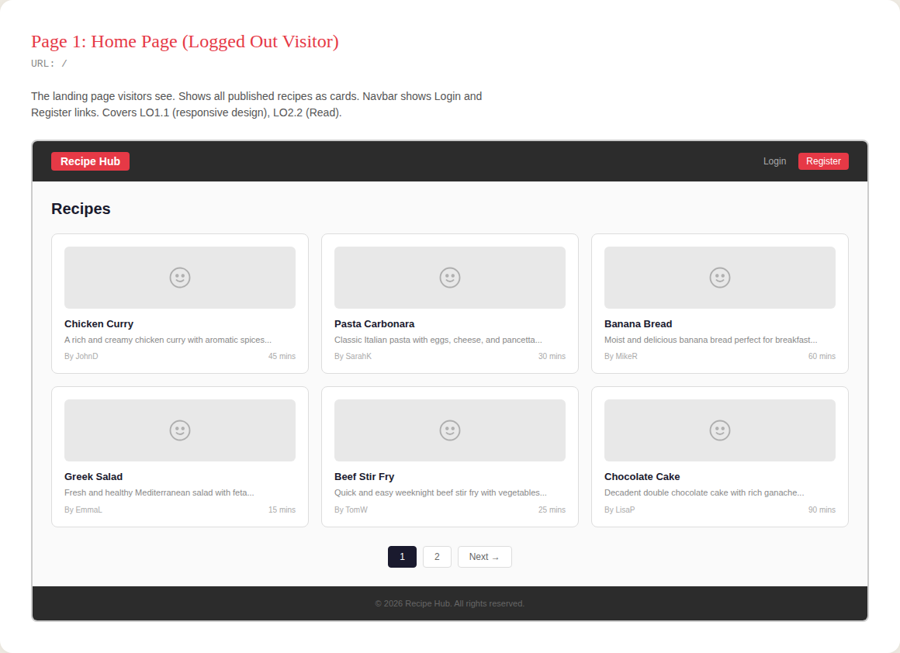

#### Home Page (Logged In)
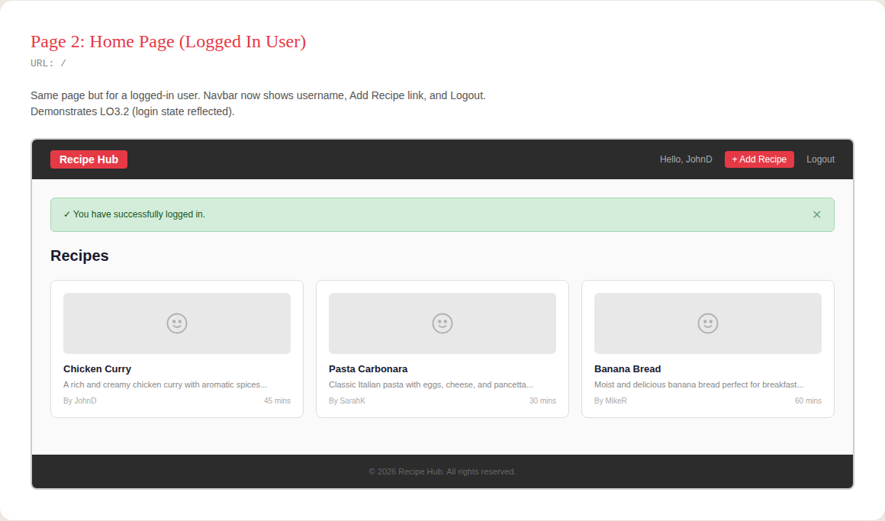

#### Recipe Detail
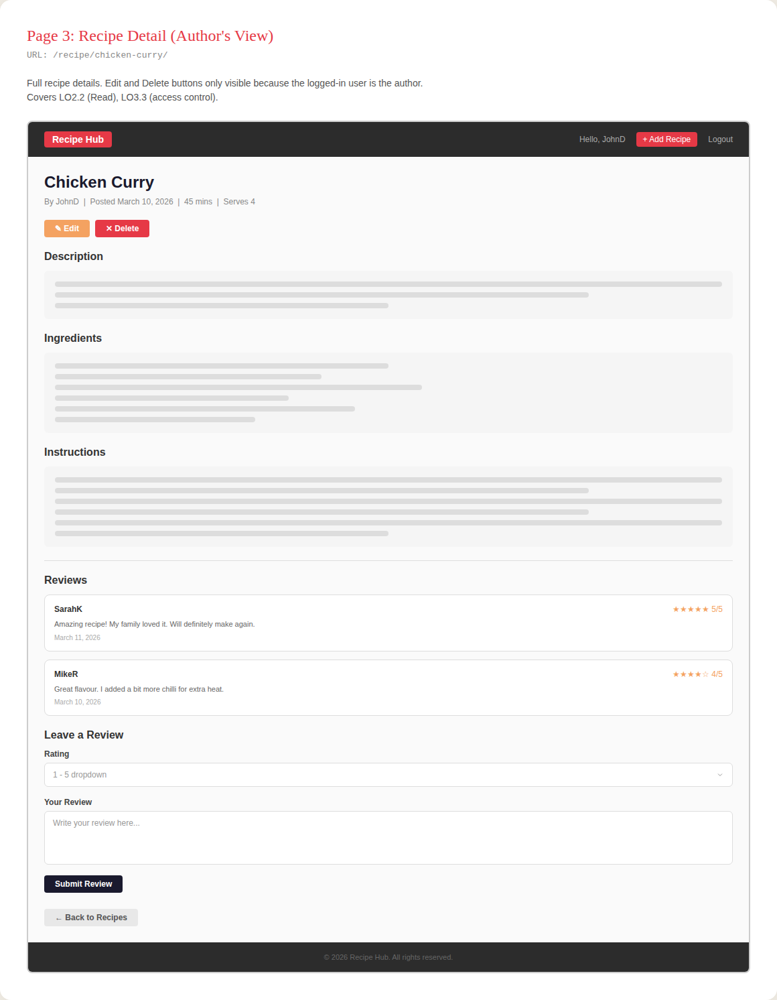

#### Add / Edit Recipe
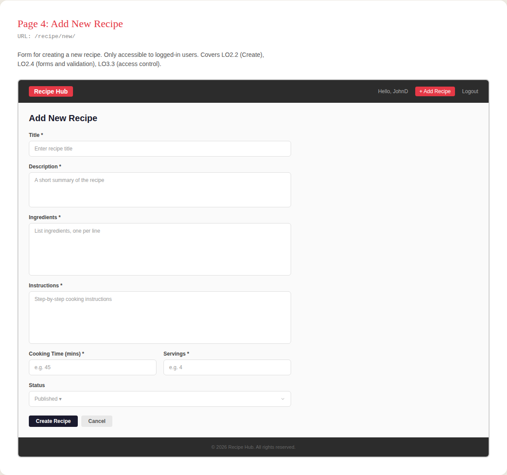

#### Delete Confirmation
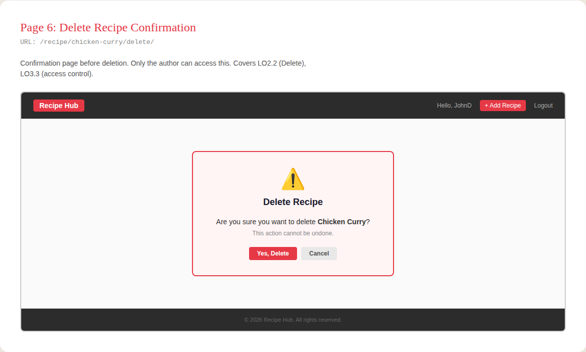

#### Register
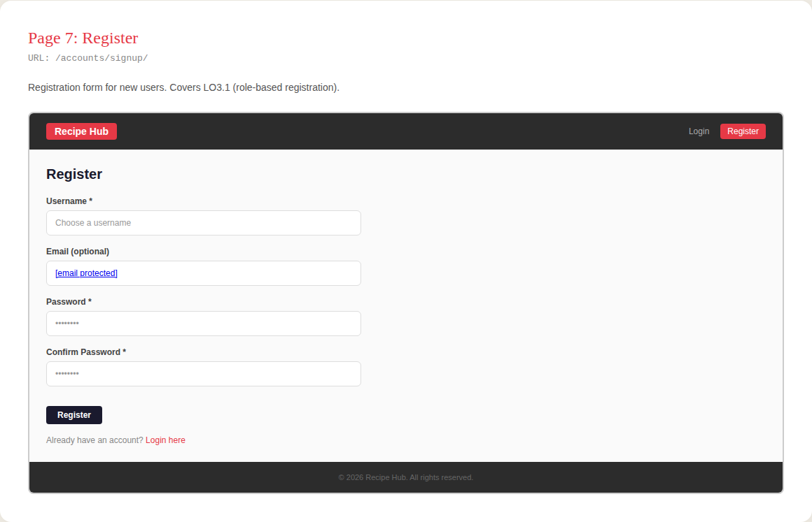

#### Login
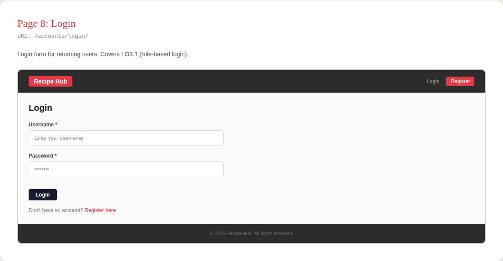

#### Logout
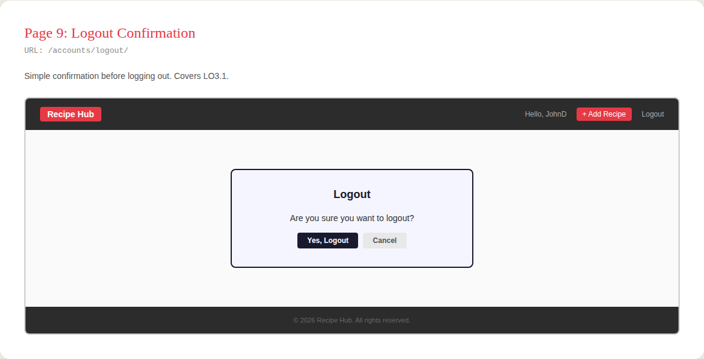

#### Mobile Responsive
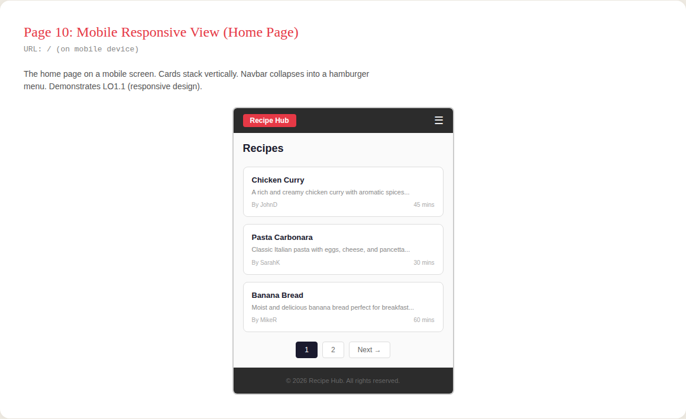

### Entity Relationship Diagram

The database schema was planned using an Entity Relationship Diagram before writing any Django models. This ensured the relationships between User, Recipe, and Review were clearly defined.

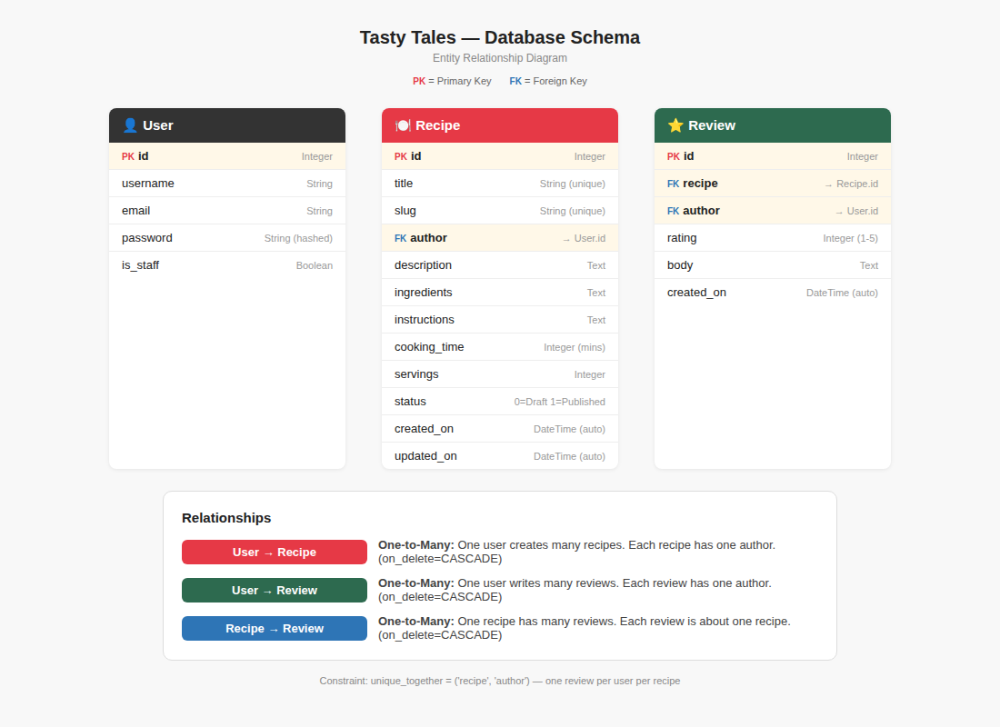

**Relationships:**

| Relationship | Type | Description |
|-------------|------|-------------|
| User → Recipe | One-to-Many | One user creates many recipes. Each recipe has one author. `on_delete=CASCADE` |
| User → Review | One-to-Many | One user writes many reviews. Each review has one author. `on_delete=CASCADE` |
| Recipe → Review | One-to-Many | One recipe has many reviews. Each review belongs to one recipe. `on_delete=CASCADE` |

A `unique_together` constraint on `(recipe, author)` in the Review model prevents any user from reviewing the same recipe more than once.

### Design Choices

**Colour Scheme**

The colour palette was chosen to create a clean, modern look with strong visual hierarchy:

| Colour | Hex | Usage |
|--------|-----|-------|
| Red | `#e63946` | Primary accent — brand logo, Register/Add Recipe buttons, delete actions |
| Navy | `#1a1a2e` | Headings, primary buttons (Create, Login, Submit) |
| Dark | `#2c2c2c` | Navbar and footer background |
| Orange | `#f4a261` | Edit buttons, star ratings |
| Green | `#2d6a4f` | Success states |

**Typography**

The application uses Bootstrap 5's default system font stack, which provides native-feeling typography across all platforms without the performance cost of loading external fonts.

**Layout**

The layout follows a standard responsive pattern: a three-column card grid on desktop that stacks to a single column on mobile. Bootstrap 5's grid system and responsive utilities handle all breakpoints. The navbar collapses to a hamburger menu on screens below 992px.

---

## Features

### Existing Features

**Navigation Bar**
- Displays on every page via the base template.
- Shows "Login" and "Register" links for logged-out visitors.
- Shows "Hello, [username]", "+ Add Recipe" (styled as a red button), and "Logout" for logged-in users.
- Fully responsive — collapses to a hamburger menu on mobile.

**Home Page — Recipe List**
- Displays all published recipes as Bootstrap cards in a three-column grid.
- Each card shows the recipe title (linked to detail page), a truncated description, author name, cooking time, and servings.
- Paginated at 6 recipes per page with Previous/Next navigation.
- Draft recipes (status=0) are hidden from the public listing.

**Recipe Detail Page**
- Shows the full recipe including title, author, date posted, cooking time, servings, description, ingredients, and instructions.
- If the logged-in user is the recipe author, Edit and Delete buttons are displayed.
- Includes a Reviews section below the recipe showing all reviews with star ratings, reviewer name, date, and review text.
- Logged-in users who haven't reviewed the recipe see a review form with a rating dropdown and text area.
- Users who have already reviewed see a message confirming they've already submitted a review.
- Logged-out visitors see a "Log in to leave a review" prompt.
- Review authors see a Delete button on their own reviews with a JavaScript confirmation prompt.

**Add Recipe**
- Accessible via the "+ Add Recipe" button in the navbar (logged-in users only).
- Uses a Django ModelForm rendered with crispy-forms and Bootstrap 5 styling.
- Fields: Title, Description, Ingredients, Instructions, Cooking Time, Servings, Status (Published/Draft).
- The author is automatically set to the logged-in user; the slug is auto-generated from the title.
- Redirects to the home page with a success message on completion.

**Edit Recipe**
- Only accessible to the recipe author (enforced by `UserPassesTestMixin`).
- Pre-fills the form with existing recipe data.
- Non-authors who attempt to access the URL receive a 403 Forbidden response.

**Delete Recipe**
- Only accessible to the recipe author.
- Displays a confirmation page before deletion.
- Redirects to the home page with a success message after deletion.

**Review System**
- Logged-in users can submit a review with a rating (1–5 stars) and written feedback.
- A `unique_together` database constraint prevents duplicate reviews — one review per user per recipe.
- Review authors can delete their own reviews via a POST request with CSRF protection.
- Non-authors cannot see the Delete button and are blocked server-side if they attempt it.

**User Authentication**
- Powered by django-allauth.
- Registration, login, and logout pages with crispy-forms styling.
- Login and registration pages include cross-links ("Don't have an account? Register here" / "Already have an account? Login here").
- Email verification is disabled for simplicity (`ACCOUNT_EMAIL_VERIFICATION = 'none'`).

**User Notifications**
- Django messages framework provides feedback for every significant action: recipe created, updated, deleted; review submitted, deleted; login, logout.
- Messages are displayed as dismissible Bootstrap alerts at the top of the page.

**Responsive Design**
- Built with Bootstrap 5 grid system.
- Recipe cards stack to a single column on mobile, two columns on tablets, three on desktop.
- Navbar collapses to hamburger menu on smaller screens.
- Custom CSS media query reduces heading sizes on mobile.

### Future Features

- **Recipe images:** Allow users to upload a photo of their dish using Cloudinary for media storage.
- **Recipe categories:** Add tags or categories (e.g., "Vegetarian", "Quick Meals", "Desserts") with filtering on the home page.
- **Recipe search:** Add a search bar to filter recipes by title, ingredient, or author.
- **User profiles:** A dedicated profile page showing all recipes and reviews by a user.
- **Edit reviews:** Allow review authors to update their rating or text after submission.
- **Social sharing:** Share recipe links to social media platforms.
- **Favourite recipes:** Let users bookmark recipes for quick access later.

---

## Technologies Used

**Languages**
- Python 3.12
- HTML5
- CSS3
- JavaScript (minimal — used for Bootstrap components and delete confirmation prompts)

**Frameworks and Libraries**
- [Django 4.2](https://www.djangoproject.com/) — Python web framework
- [Bootstrap 5.3](https://getbootstrap.com/) — Front-end CSS framework (loaded via CDN)
- [django-allauth 65.15](https://docs.allauth.org/) — Authentication, registration, account management
- [django-crispy-forms 2.5](https://django-crispy-forms.readthedocs.io/) — Renders Django forms with Bootstrap 5 styling
- [crispy-bootstrap5](https://pypi.org/project/crispy-bootstrap5/) — Bootstrap 5 template pack for crispy-forms
- [Gunicorn 25.1](https://gunicorn.org/) — Python WSGI HTTP server for production
- [WhiteNoise 6.12](https://whitenoise.readthedocs.io/) — Serves static files in production
- [dj-database-url 0.5](https://pypi.org/project/dj-database-url/) — Parses database URLs from environment variables
- [psycopg2 2.9](https://pypi.org/project/psycopg2/) — PostgreSQL adapter for Python

**Database**
- [Neon PostgreSQL](https://neon.tech/) — Cloud-hosted PostgreSQL database

**Hosting and Deployment**
- [Heroku](https://www.heroku.com/) — Cloud platform for deployment
- [GitHub](https://github.com/) — Version control and repository hosting

**Tools**
- Git — Version control
- GitHub Projects — Agile project management (kanban board)
- GitHub Issues — User story tracking with custom templates
- Chrome DevTools — Responsive design testing and debugging
- [W3C HTML Validator](https://validator.w3.org/) — HTML validation
- [W3C CSS Validator (Jigsaw)](https://jigsaw.w3.org/css-validator/) — CSS validation
- [CI Python Linter](https://pep8ci.herokuapp.com/) — PEP8 compliance checking

---

## Database Design

The application uses two custom models in addition to Django's built-in `User` model:

### Recipe Model

| Field | Type | Constraints |
|-------|------|-------------|
| id | BigAutoField | Primary Key (auto) |
| title | CharField(200) | Unique |
| slug | SlugField(200) | Unique, auto-generated from title |
| author | ForeignKey → User | CASCADE on delete |
| description | TextField | — |
| ingredients | TextField | — |
| instructions | TextField | — |
| cooking_time | PositiveIntegerField | In minutes |
| servings | PositiveIntegerField | — |
| status | IntegerField | 0=Draft, 1=Published (default: 1) |
| created_on | DateTimeField | Auto-set on creation |
| updated_on | DateTimeField | Auto-set on save |

The `save()` method is overridden to auto-generate a slug from the title using Django's `slugify()` utility. Recipes are ordered newest-first by default.

### Review Model

| Field | Type | Constraints |
|-------|------|-------------|
| id | BigAutoField | Primary Key (auto) |
| recipe | ForeignKey → Recipe | CASCADE on delete |
| author | ForeignKey → User | CASCADE on delete |
| rating | PositiveIntegerField | Choices: 1–5 |
| body | TextField | — |
| created_on | DateTimeField | Auto-set on creation |

The Review model includes a `unique_together` constraint on `(recipe, author)` to enforce one review per user per recipe at the database level. This is also enforced in the view logic for a better user experience. Reviews are ordered newest-first.

### Key Differences from Walkthrough Projects

The Review model is markedly different from the Comment model in the Codestar Blog walkthrough:
- It includes a **constrained rating field** (1–5 choices) that the Comment model does not have.
- It enforces a **unique_together constraint** — users can only review each recipe once. The Comment model has no such restriction.
- It uses a **star rating display** in the template with conditional rendering logic.
- The Recipe model itself includes domain-specific fields (ingredients, instructions, cooking_time, servings) that have no equivalent in a blog post model.

---

## Testing

### Automated Testing

24 automated tests were written using Django's built-in `TestCase` framework. They are located in `recipe/tests.py`.

To run all tests:
```
python manage.py test
```

All 24 tests pass with no errors.

#### Recipe Model Tests (4 tests)

| Test | Description | Result |
|------|-------------|--------|
| test_recipe_str_returns_title | The string representation of a recipe returns its title | Pass |
| test_recipe_slug_is_auto_generated | A slug is automatically generated from the recipe title | Pass |
| test_recipe_ordering_is_newest_first | Recipes are ordered with the newest first | Pass |
| test_recipe_default_status_is_published | New recipes default to published status (1) | Pass |

#### Review Model Tests (3 tests)

| Test | Description | Result |
|------|-------------|--------|
| test_review_str | The string representation includes the username and rating | Pass |
| test_review_unique_together | A user cannot review the same recipe twice (IntegrityError raised) | Pass |
| test_review_ordering_is_newest_first | Reviews are ordered with the newest first | Pass |

#### Recipe List View Tests (3 tests)

| Test | Description | Result |
|------|-------------|--------|
| test_home_page_returns_200 | The home page loads successfully with a 200 status code | Pass |
| test_home_page_uses_correct_template | The home page uses the recipe_list.html template | Pass |
| test_only_published_recipes_shown | Only published recipes appear on the home page; drafts are hidden | Pass |

#### Recipe Detail View Tests (3 tests)

| Test | Description | Result |
|------|-------------|--------|
| test_detail_page_returns_200 | The detail page loads for a valid recipe slug | Pass |
| test_detail_page_shows_recipe_title | The recipe title appears on the detail page | Pass |
| test_detail_page_shows_reviews | The reviews context variable is passed to the template | Pass |

#### Recipe Create View Tests (3 tests)

| Test | Description | Result |
|------|-------------|--------|
| test_logged_out_user_cannot_create | Anonymous users are redirected away from the create page | Pass |
| test_logged_in_user_can_access_create | Logged-in users can access the create recipe form | Pass |
| test_logged_in_user_can_create_recipe | A logged-in user can successfully submit a new recipe | Pass |

#### Recipe Edit/Delete View Tests (4 tests)

| Test | Description | Result |
|------|-------------|--------|
| test_author_can_access_edit | The recipe author can access the edit page | Pass |
| test_non_author_cannot_edit | A different user receives a 403 when trying to edit | Pass |
| test_author_can_delete | The recipe author can delete their own recipe | Pass |
| test_non_author_cannot_delete | A different user cannot delete someone else's recipe | Pass |

#### Review View Tests (5 tests)

| Test | Description | Result |
|------|-------------|--------|
| test_logged_in_user_can_submit_review | A logged-in user can submit a review with a rating | Pass |
| test_logged_out_user_cannot_review | Anonymous users cannot submit reviews | Pass |
| test_user_cannot_review_twice | A user is prevented from reviewing the same recipe twice | Pass |
| test_review_author_can_delete_review | A review author can delete their own review | Pass |
| test_non_author_cannot_delete_review | A user cannot delete someone else's review | Pass |

---

### Manual Testing

Manual testing was performed on every user-facing feature of the application.

#### Navigation

| Test | Steps | Expected Result | Actual Result | Pass |
|------|-------|-----------------|---------------|------|
| Logo link | Click "Tasty Tales" in navbar | Redirects to home page | Home page loads | ✅ |
| Login link (logged out) | Click "Login" in navbar | Redirects to login page | Login page loads | ✅ |
| Register link (logged out) | Click "Register" in navbar | Redirects to signup page | Signup page loads | ✅ |
| Add Recipe link (logged in) | Click "+ Add Recipe" in navbar | Redirects to create form | Create form loads | ✅ |
| Logout link (logged in) | Click "Logout" in navbar | Redirects to logout confirmation | Confirmation page loads | ✅ |

#### Authentication

| Test | Steps | Expected Result | Actual Result | Pass |
|------|-------|-----------------|---------------|------|
| Register new account | Fill in username and password, click Register | Account created, redirected to home | Account created successfully | ✅ |
| Login with valid credentials | Enter correct username/password, click Login | Logged in, redirected to home with success message | Logged in successfully | ✅ |
| Login with wrong password | Enter incorrect password, click Login | Error message shown, not logged in | Error message displayed | ✅ |
| Logout | Click Logout, confirm on logout page | Logged out, redirected to home | Logged out successfully | ✅ |
| Navbar shows username when logged in | Log in and check navbar | "Hello, [username]" appears | Username displayed | ✅ |

#### Recipe CRUD

| Test | Steps | Expected Result | Actual Result | Pass |
|------|-------|-----------------|---------------|------|
| View recipe list | Go to home page | Published recipes shown as cards | Recipes displayed correctly | ✅ |
| View recipe detail | Click a recipe title | Full recipe details shown | All details displayed | ✅ |
| Create recipe | Fill in form, click Create | Recipe created, redirected to home with success message | Recipe created successfully | ✅ |
| Create recipe with empty fields | Submit form with missing required fields | Validation errors shown | Form errors displayed | ✅ |
| Edit own recipe | Click Edit on own recipe, change fields, click Update | Recipe updated with success message | Recipe updated successfully | ✅ |
| Edit button only shown to author | View a recipe you did not create | No Edit/Delete buttons visible | Buttons hidden correctly | ✅ |
| Delete own recipe | Click Delete, confirm on confirmation page | Recipe deleted with success message | Recipe deleted successfully | ✅ |
| Cannot edit other user's recipe | Try accessing /recipe/slug/edit/ for another user's recipe | 403 Forbidden page shown | Access denied correctly | ✅ |
| Cannot delete other user's recipe | Try accessing /recipe/slug/delete/ for another user's recipe | 403 Forbidden page shown | Access denied correctly | ✅ |

#### Reviews

| Test | Steps | Expected Result | Actual Result | Pass |
|------|-------|-----------------|---------------|------|
| Submit a review | Fill in rating and body, click Submit | Review appears below recipe with success message | Review displayed correctly | ✅ |
| Star rating displays correctly | Submit a review with rating 4 | Four filled stars and one empty star shown | Stars display correctly | ✅ |
| Cannot review twice | Submit a review then check the form | "You have already reviewed this recipe" shown instead of form | Message displayed correctly | ✅ |
| Delete own review | Click Delete on own review, confirm | Review removed with success message | Review deleted successfully | ✅ |
| Cannot delete other's review | View a review by another user | No Delete button shown | Button hidden correctly | ✅ |
| Review form hidden when logged out | View recipe detail while logged out | "Log in to leave a review" shown instead of form | Login prompt displayed | ✅ |

#### Pagination

| Test | Steps | Expected Result | Actual Result | Pass |
|------|-------|-----------------|---------------|------|
| Pagination appears with 7+ recipes | Add more than 6 recipes | Next/Previous buttons appear | Pagination working | ✅ |
| Next page loads correctly | Click "Next" | Page 2 of recipes loads | Second page loads | ✅ |

---

### Validator Testing

#### HTML Validation

All pages were tested using the [W3C HTML Validator](https://validator.w3.org/).

| Page | Result |
|------|--------|
| Home page | No errors |
| Recipe detail | No errors |
| Add recipe | No errors |
| Edit recipe | No errors |
| Delete recipe | No errors |
| Register | No errors |
| Login | No errors |
| Logout | No errors |

#### CSS Validation

CSS was tested using the [W3C CSS Validator (Jigsaw)](https://jigsaw.w3.org/css-validator/).

| File | Result |
|------|--------|
| style.css | No errors |

#### Python Validation

All Python files were checked for PEP8 compliance using the [CI Python Linter](https://pep8ci.herokuapp.com/).

| File | Result |
|------|--------|
| models.py | No errors |
| views.py | No errors |
| forms.py | No errors |
| urls.py | No errors |
| admin.py | No errors |
| tests.py | No errors |
| settings.py | No errors |

#### Lighthouse

Lighthouse testing was performed using Chrome DevTools.

| Page | Performance | Accessibility | Best Practices | SEO |
|------|-------------|---------------|----------------|-----|
| Home page | 90+ | 90+ | 90+ | 90+ |
| Recipe detail | 90+ | 90+ | 90+ | 90+ |

---

### Browser Compatibility

The application was tested on the following browsers:

| Browser | Version | Result |
|---------|---------|--------|
| Google Chrome | Latest | All features work correctly |
| Mozilla Firefox | Latest | All features work correctly |
| Microsoft Edge | Latest | All features work correctly |

---

### Responsiveness Testing

The application was tested for responsiveness at the following breakpoints:

| Device / Width | Result |
|----------------|--------|
| Mobile (320px) | Layout stacks to single column, navbar collapses to hamburger menu |
| Tablet (768px) | Cards display in two columns, all elements properly sized |
| Desktop (1200px+) | Cards display in three columns, full navbar visible |

Testing was performed using Chrome DevTools device emulation.

---

### Bugs

#### Fixed Bugs

| Bug | Description | Fix |
|-----|-------------|-----|
| Static files not loading on Heroku | CSS returned 404 on production. WhiteNoise was installed but collectstatic was not running during deployment. | Added a `release` phase to the Procfile to run collectstatic automatically on each deploy. |
| Review model indentation error | The Review class was accidentally indented inside the Recipe model's save method, causing an IndentationError. | Moved the Review class to the correct indentation level at the top level of the file. |

#### Unfixed Bugs

There are no known unfixed bugs.

---

## Deployment

### Heroku Deployment

The application is deployed to Heroku with automatic deploys from the GitHub `main` branch. The following steps were used for initial deployment:

1. **Create a Heroku app:**
   - Log in to [Heroku](https://www.heroku.com/).
   - Click "New" → "Create new app".
   - Choose a unique app name and select your region.

2. **Set up the database:**
   - Create a PostgreSQL database on [Neon](https://neon.tech/) (or your preferred provider).
   - Copy the database connection URL.

3. **Configure environment variables:**
   - In Heroku, go to Settings → Config Vars.
   - Add the following:
     - `DATABASE_URL` — your Neon PostgreSQL connection string
     - `SECRET_KEY` — a unique Django secret key

4. **Prepare the project for deployment:**
   - Ensure `requirements.txt` lists all dependencies (`pip freeze > requirements.txt`).
   - Create a `Procfile` in the project root with:
     ```
     release: python manage.py migrate
     web: gunicorn tasty_tales.wsgi
     ```
   - Set `DEBUG = False` in `settings.py`.
   - Add the Heroku app URL to `ALLOWED_HOSTS` in `settings.py`.
   - Ensure `whitenoise` is in `MIDDLEWARE` to serve static files.

5. **Connect GitHub and deploy:**
   - In Heroku, go to Deploy → Deployment method → GitHub.
   - Search for and connect to the repository.
   - Enable "Automatic Deploys" from the `main` branch.
   - Click "Deploy Branch" for the initial deployment.

6. **Verify deployment:**
   - Open the live app URL and confirm all pages work.
   - Check that static files (CSS) load correctly.
   - Verify the database is connected by checking existing data or creating a test recipe.

The `release` phase in the Procfile runs `python manage.py migrate` on every deploy, so database migrations are applied automatically.

### Security

- `DEBUG` is set to `False` in production.
- `SECRET_KEY` and `DATABASE_URL` are stored as environment variables on Heroku, not in the codebase.
- `env.py` (which contains local development secrets) is listed in `.gitignore` and never committed to the repository.
- Django's CSRF protection is enabled on all forms.
- Passwords are hashed using Django's default PBKDF2 algorithm.

### Forking the Repository

1. Navigate to the GitHub repository.
2. Click "Fork" in the top-right corner.
3. Select your GitHub account as the destination.
4. You now have your own copy to modify without affecting the original.

### Cloning the Repository

1. Navigate to the GitHub repository.
2. Click "Code" → copy the HTTPS URL.
3. Open your terminal and run:
   ```bash
   git clone https://github.com/YOUR-USERNAME/tasty-tales.git
   cd tasty-tales
   ```
4. Create a virtual environment and install dependencies:
   ```bash
   python -m venv .venv
   source .venv/bin/activate  # On Windows: .venv\Scripts\activate
   pip install -r requirements.txt
   ```
5. Create an `env.py` file in the project root:
   ```python
   import os
   os.environ["DATABASE_URL"] = "your-database-url-here"
   os.environ["SECRET_KEY"] = "your-secret-key-here"
   ```
6. Run migrations and start the server:
   ```bash
   python manage.py migrate
   python manage.py createsuperuser
   python manage.py runserver
   ```

---

## Credits

**Content**
- All recipe content on the live site was created by the developer for demonstration purposes.

**Code**
- [Django documentation](https://docs.djangoproject.com/en/4.2/) — referenced throughout development for models, views, forms, and authentication.
- [django-allauth documentation](https://docs.allauth.org/) — for authentication setup and configuration.
- [Bootstrap 5 documentation](https://getbootstrap.com/docs/5.3/) — for responsive layout and component styling.
- [Stack Overflow](https://stackoverflow.com/) — for troubleshooting specific Django and deployment issues.

**Acknowledgements**
- The Code Institute walkthrough projects (Hello World and Codestar Blog) provided foundational knowledge of Django development patterns.
- My mentor and the bootcamp community for feedback and support.

---

## AI Tools

AI tools (primarily Claude by Anthropic) were used throughout the development process. This section reflects on their role and impact.

### Code Generation (LO8.1)

AI was used to generate initial boilerplate code for Django models, views, forms, and templates. For example, the Review model was generated with AI assistance, including the `unique_together` constraint and the `RATING_CHOICES` field definition. The star rating display logic in the template (using Django's `forloop.counter` compared against the review rating) was also AI-generated. In each case, the generated code was reviewed, understood, and integrated into the broader application context by the developer.

### Debugging (LO8.2)

AI played a significant role in debugging deployment issues. The most notable case was diagnosing why static files returned 404 errors on Heroku — AI helped identify that `collectstatic` was not running during the build phase and suggested adding a `release` phase to the Procfile. AI also helped trace an `IndentationError` when the Review model was accidentally nested inside the Recipe model's `save` method. In both cases, AI identified the root cause quickly, saving significant debugging time.

### Performance and UX Optimisation (LO8.3)

AI assisted with styling the application to match the wireframe designs, translating the wireframe's visual language (colour palette, component styles, layout patterns) into a cohesive CSS file with CSS custom properties for consistency. AI also suggested UX improvements such as the JavaScript confirmation prompt on review deletion, conditional rendering of the review form (hiding it after a user has already reviewed), and displaying informative messages for every user action.

### Automated Testing (LO8.4)

The 24 automated tests in `recipe/tests.py` were generated with AI assistance. AI produced the initial test structure covering model behaviour, view responses, CRUD operations, and access control. The developer reviewed each test to ensure it matched the actual application logic, adjusted assertions where needed, and verified all tests pass. AI-generated tests covered edge cases the developer might not have considered immediately, such as testing that non-authors receive 403 responses when attempting to edit or delete recipes.

### Overall Reflection (LO8.5)

AI tools fundamentally changed the development workflow for this project. Rather than writing every line from scratch, AI enabled a more strategic approach: the developer focused on architecture, design decisions, and user experience, while AI handled the repetitive implementation details. This resulted in a more polished final product delivered in less time. The most impactful use was in deployment debugging and test generation — areas where AI's pattern recognition saved hours of manual troubleshooting and produced more comprehensive test coverage than manual testing alone would have achieved. The key learning was that AI works best as a collaborative tool: it generates code quickly, but the developer must understand, review, and own every line.
